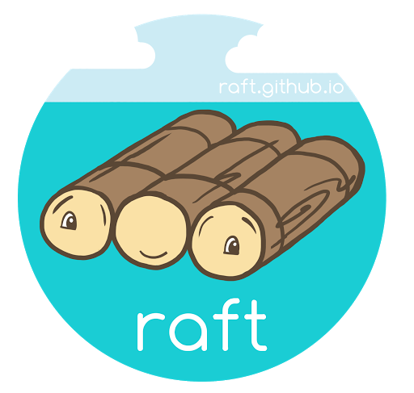

# RAFT - Algorithm Implementation

Raft is a consensus algorithm designed as an alternative to the Paxos family of algorithms. It was meant to be more understandable than Paxos by means of separation of logic, but it is also formally proven safe and offers some additional features.

• Implemented various aspects of the RAFT algorithm such as leader election, log replication bringing consensus on an action among distributed computing nodes by working in a team of 2 people.

• Established algorithmic logic in Python and employed docker containers to simulate 5 independent nodes as servers.

## Technologies used:

1. Python
2. Docker
3. Flask

## Demo:

https://github.com/rameshpav1321/RAFT_algorithm_implementation/assets/90695775/386458aa-b615-469e-86b9-8421f233ccf8

## Resources to best understand the paper:

1. The paper itself - https://raft.github.io/raft.pdf
2. For visualization - https://raft.github.io
